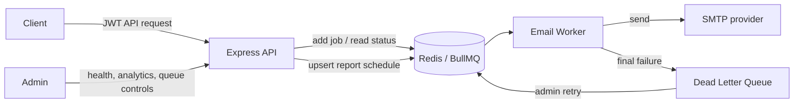

# Job Queue System

## Overview

This service accepts email delivery requests, persists them in Redis through BullMQ, and processes them in a separate worker. Moving slow, unreliable SMTP work out of the request path keeps the API responsive and gives failed work a controlled retry and Dead Letter Queue (DLQ) lifecycle.

## Architecture



## Features

- Express API with Helmet, request IDs, 1 MB request-body limits, compression, and production CORS allow-listing.
- JWT authentication with an admin role; email submission and all operational routes require a token.
- Redis-backed, atomic fixed-window rate limits for login, email creation, and administrative endpoints.
- BullMQ email queue with three attempts, exponential backoff starting at two seconds, and bounded job retention.
- Separate worker process with graceful shutdown and final-failure DLQ handling.
- Deterministic DLQ IDs prevent duplicate records; deterministic retry IDs prevent concurrent DLQ retries from duplicating work.
- Daily report job scheduler, configurable by cron expression and timezone. The current report handler is deliberately a placeholder that records a generated result—it does not generate or email a report yet.
- Admin queue controls, job inspection/retry, DLQ management, analytics, monitoring, health checks, Swagger UI, and Bull Board.
- Development and production Docker Compose configurations.

## Tech Stack

Node.js, Express 5, BullMQ, Redis, Nodemailer, JWT, bcrypt, Zod, Winston, Jest, Swagger/OpenAPI, Docker, and Docker Compose.

## Project Structure

```text
src/
  config/        Environment, Redis, BullMQ, mail, and logging configuration
  controllers/   HTTP response orchestration
  middleware/    Authentication, authorization, validation, rate limits, errors
  queues/        Email and dead-letter BullMQ queues
  services/      Authentication, email, DLQ, jobs, analytics, and monitoring logic
  workers/       Background email processor
  schedulers/    Persistent BullMQ job-scheduler setup
  routes/        HTTP endpoints and OpenAPI annotations
test/            Redis-backed integration and worker lifecycle tests
```

## How It Works

1. An authenticated client submits `POST /api/email`.
2. The API validates the payload, applies a per-user Redis rate limit, and adds a `send-email` job.
3. BullMQ stores the job in Redis and a worker claims it independently of the HTTP request.
4. The worker sends the email through the configured SMTP transport.
5. SMTP failures retry up to three times with exponential backoff.
6. After the final failure, one durable DLQ record is created for administrators to inspect, retry, or delete.
7. Health, monitoring, analytics, job, queue, DLQ, Swagger, and Bull Board endpoints provide operational visibility.

## Queue Lifecycle

Successful jobs follow:

```text
waiting → active → completed
```

Failed jobs follow:

```text
waiting → active → failed → delayed retry → active → failed → DLQ
```

Completed jobs are retained for one hour (up to 1,000 jobs); failed source jobs are retained for one day (up to 5,000). DLQ records are intentionally retained until an administrator retries or deletes them.

## API Documentation

When `ENABLE_API_DOCS=true`, Swagger UI is available at `/api-docs`. It documents the exposed routes and bearer authentication scheme. The UI is disabled by default in production; enable it only on a controlled internal surface.

Operational endpoints are under `/api/jobs`, `/api/queue`, `/api/dlq`, `/api/analytics`, and `/api/monitor`. They require an admin bearer token. `GET /health` is intentionally public for load balancers and orchestration.

## Authentication

`POST /api/auth/login` accepts an administrator email and password. The configured `ADMIN_PASSWORD` value must be a bcrypt hash. A successful login returns a JWT containing the `admin` role; send it as:

```http
Authorization: Bearer <token>
```

Generate a password hash locally with:

```bash
node -e "import('bcrypt').then(({default:bcrypt}) => bcrypt.hash('choose-a-strong-password', 12).then(console.log))"
```

## Rate Limiting

The service applies fixed-window limits in Redis:

| Surface        | Limit                                       |
| -------------- | ------------------------------------------- |
| Login          | 5 requests/minute per client IP             |
| Email creation | 20 requests/minute per authenticated email  |
| Admin APIs     | 100 requests/minute per authenticated email |

Redis performs the increment and initial TTL in one Lua operation, preventing an unexpired counter from being left behind by a process interruption. Identifiers are SHA-256 hashed before becoming Redis key material.

## DLQ

The worker creates a DLQ record only after the final configured attempt. The DLQ job ID is deterministically derived from the source queue and job ID, so repeated failure events cannot create duplicates. Retrying a DLQ record creates a deterministically identified new email job and then removes the DLQ record. Do not retry its original failed email job directly; the API returns `409` and directs callers to the DLQ retry endpoint.

## Monitoring

- `GET /health` reports Redis and queue connectivity, uptime, and timestamp; it returns `503` if either dependency is unhealthy.
- `GET /api/analytics` returns retained queue counts and success/failure rates.
- `GET /api/monitor` returns queue counts, process metrics, and actual Redis connection state.
- `GET /admin/queues` exposes Bull Board when `ENABLE_BULL_BOARD=true`; it is protected by the admin JWT middleware. In a browser deployment, place it behind an authenticated reverse proxy that supplies the bearer header.

## Docker

Development Compose mounts the project and uses the Dockerfile's `development` stage, which includes Nodemon. Production Compose uses the smaller `production` stage, persistent Redis storage, no published Redis port, an unprivileged `node` user, and a 35-second stop grace period.

```bash
cp .env.example .env
# Fill every placeholder in .env, especially JWT_SECRET, ADMIN_PASSWORD, and SMTP settings.
docker compose up --build
```

Verify the service:

```bash
curl http://localhost:3000/health
```

For production-like local containers:

```bash
docker compose -f docker-compose.prod.yml up --build
```

## Local Development

1. Copy `.env.example` to `.env` and replace all placeholder secrets.
2. Start Redis, for example `docker compose up redis`.
3. Install dependencies with `npm ci`.
4. Start the API: `npm run dev`.
5. In a second terminal, start the worker: `npm run worker`.

The API configures the persistent daily report scheduler on startup. `npm run scheduler` is also available to upsert that schedule as a standalone deployment/bootstrap command.

## Testing

Tests require a reachable Redis instance. They use their own BullMQ and rate-limit prefixes, so they do not erase development queue data.

```bash
npm test
npm run lint
npm run check-env
```

The test suite covers authentication and authorization, request IDs, health, rate-limit TTLs and identities, queue administration, worker success/retry/backoff/final failure, DLQ idempotency/retry/delete/lookups, analytics, and monitoring.

## Environment Variables

| Variable                                           | Required | Purpose                                                                       |
| -------------------------------------------------- | -------- | ----------------------------------------------------------------------------- |
| `NODE_ENV`                                         | No       | `development`, `test`, or `production`; production enables stricter defaults. |
| `PORT`                                             | No       | HTTP port; defaults to `3000`.                                                |
| `REDIS_HOST`, `REDIS_PORT`                         | Yes      | Redis connection target.                                                      |
| `REDIS_PASSWORD`                                   | No       | Redis password for managed Redis.                                             |
| `BULLMQ_PREFIX`                                    | No       | Namespace for BullMQ Redis keys.                                              |
| `RATE_LIMIT_KEY_PREFIX`                            | No       | Namespace for rate-limit Redis keys.                                          |
| `JWT_SECRET`                                       | Yes      | Token signing secret; at least 32 characters in production.                   |
| `JWT_EXPIRES_IN`                                   | No       | JWT lifetime; defaults to `1h`.                                               |
| `ADMIN_EMAIL`, `ADMIN_PASSWORD`                    | Yes      | Admin email and bcrypt password hash.                                         |
| `MAIL_HOST`, `MAIL_PORT`, `MAIL_USER`, `MAIL_PASS` | Yes      | SMTP transport configuration.                                                 |
| `MAIL_SECURE`                                      | No       | `true` for implicit TLS (typically port 465); otherwise `false`.              |
| `MAIL_FROM`                                        | No       | Sender address; defaults to `MAIL_USER`.                                      |
| `CORS_ORIGINS`                                     | No       | Comma-separated production browser origins.                                   |
| `REPORT_SCHEDULE`, `REPORT_TIMEZONE`               | No       | BullMQ cron schedule and optional timezone for the report job.                |
| `ENABLE_API_DOCS`, `ENABLE_BULL_BOARD`             | No       | Explicitly expose developer/admin UIs; both default to `false` in production. |
| `LOG_LEVEL`, `SHUTDOWN_TIMEOUT_MS`                 | No       | Log verbosity and process shutdown deadline.                                  |

## Pre-Flight Environment Check

Before deploying to staging or production, run the pre-flight verification tool:

```bash
npm run check-env
```

This verifies that all required secrets are provided, `JWT_SECRET` meets production length requirements (minimum 32 characters), `ADMIN_PASSWORD` is a valid bcrypt hash, and network ports are correctly configured.

## CI/CD Pipeline

The repository includes a GitHub Actions workflow in `.github/workflows/ci-cd.yml` that automatically:
1. Runs ESLint (`npm run lint`).
2. Validates environment configurations (`npm run check-env`).
3. Runs integration tests with an ephemeral Redis service container (`npm test`).
4. Verifies multi-stage production Docker image compilation.

## Production Deployment

Deploy the API and worker as separate processes/services that share the same managed Redis instance.

### Option 1: Render Infrastructure-as-Code (Blueprint)

This repository includes a `render.yaml` blueprint:
1. Connect your repository to Render.
2. Select **New > Blueprint**.
3. Render automatically provisions the API web service, worker service, and Redis database with built-in health checks and environment mapping.

### Option 2: Production Docker Compose

For containerized environments (AWS EC2, DigitalOcean, VPS):

```bash
# 1. Prepare environment variables
cp .env.example .env

# 2. Run pre-flight check
npm run check-env

# 3. Launch production containers
docker compose -f docker-compose.prod.yml up -d --build
```

### Option 3: Railway / Fly.io

1. Create two services from this repo:
   - **API Service**: Start Command `npm start`, Health Check Path `/health`.
   - **Worker Service**: Start Command `npm run worker`.
2. Provision a Redis service and pass `REDIS_HOST`, `REDIS_PORT`, and `REDIS_PASSWORD` to both services.

Never expose Redis publicly. The production Compose file intentionally omits a Redis host-port mapping.

## Graceful Shutdown

On `SIGINT` or `SIGTERM`, the API stops accepting HTTP connections, closes both queues and QueueEvents, then quits its infrastructure Redis client. The worker stops claiming new jobs, waits for active work and pending DLQ writes, then closes its queues. Both paths are idempotent and force termination only after `SHUTDOWN_TIMEOUT_MS`; Docker's production grace period is set to 35 seconds.

## Future Improvements

- Replace the report-job placeholder with an actual report generator and delivery policy.
- Add a persistent user/tenant model and per-user authorization if the system expands beyond a single admin account.
- Add metrics export and alerting (for example, Prometheus/OpenTelemetry) for queue lag, DLQ growth, and SMTP failure rate.
- Use an outbox or idempotency key strategy if callers need end-to-end exactly-once business semantics; BullMQ provides at-least-once delivery in failure scenarios.

## License

Licensed under the ISC license declared in `package.json`.

