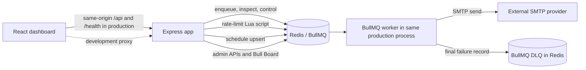

# Job Queue System: Interview Preparation

This guide is based on the code in this repository. It distinguishes implemented behavior from intended goals and recommendations. Personal motivation cannot be proven from source code; the project goal below is inferred from the architecture and UI.

Code links in this guide are relative to this document.

## 1. Project Overview

### What it does

This is an email-job processing system with an Express REST API and React operations dashboard. The API validates an email request, places it on a BullMQ queue stored in Redis, and returns a job ID before SMTP delivery happens. A BullMQ worker sends the email asynchronously. BullMQ retries failures; after the final failed attempt, the worker records a separate dead-letter queue (DLQ) entry for an administrator to inspect, retry, or delete.

The dashboard is an operational console for queue counts, jobs, failed jobs, worker-process metrics, and health. It is not a customer email application and it does not store users or business records in a relational database.

### Problem and inferred motivation

Synchronous email delivery couples the HTTP response to an unreliable external SMTP call. Slow providers can increase latency or lead to request timeouts, and a transient provider failure can lose work if the caller has no durable retry mechanism. The implemented design moves delivery out of the request path and gives queued work retry, inspection, and DLQ handling.

A source-grounded way to explain why you built it is: “I wanted to demonstrate how to move slow email work out of an HTTP request and make it observable and recoverable with a queue.” Say this as the project's goal, not as a historical fact the code cannot prove.

### Implemented features

- One environment-configured admin login; bcrypt password comparison and expiring JWTs.
- Email enqueue endpoint with Zod validation, request IDs, and Redis-backed rate limiting.
- BullMQ email queue, retry/backoff defaults, worker lifecycle events, and job retention limits.
- DLQ creation after final failure, deterministic IDs, admin retry/delete/list/stat endpoints.
- Queue inspection and control: list/read/state/retry/delete jobs; pause, resume, drain waiting and delayed jobs.
- Queue analytics, process telemetry, health route, optional Swagger UI, and optional Bull Board.
- React dashboard with login, job submission and inspection, DLQ actions, analytics, health, and process metrics.
- Production Express static serving for the Vite build, with client-route fallback and API routes kept ahead of that fallback.
- Docker multi-stage build, development and production Compose files, Render blueprint, and GitHub Actions CI.

**Important boundary:** the scheduled daily-report job currently returns `{ type: "daily-report", status: "generated" }`. It does not assemble a report, send an email, or persist a report result outside BullMQ's job result. See [email.worker.js](../src/workers/email.worker.js) and [email.scheduler.js](../src/schedulers/email.scheduler.js).

## 2. Tech Stack and Why

Some “why” explanations are engineering rationale inferred from usage; the repository does not record the author's decision history.

| Area | Technology | What it does here / likely rationale |
| --- | --- | --- |
| Frontend | React 18 | Component-based dashboard and client-side views. |
| Frontend routing | React Router | Routes for landing, login, dashboard, jobs, failed jobs, workers, and health. |
| HTTP client | Axios | Shared API client, bearer-token interceptor, and API error handling. |
| Build/dev server | Vite | Fast React build and `/api` plus `/health` proxy during development. |
| Styling/icons | Tailwind CSS 4, `@tailwindcss/vite`, Lucide | Utility styling and consistent interface icons. |
| Runtime | Node.js 22, ES modules | Common JavaScript runtime; supports async I/O for HTTP, Redis, and SMTP. |
| HTTP | Express 5 | REST routing and middleware composition; also serves `client/dist` in production. |
| Queue | BullMQ 5 | Redis-backed job lifecycle, retries, scheduling, worker processing, and queue controls. |
| Queue/rate-limit store | Redis via ioredis | BullMQ persistence and atomic rate-limit counters/TTLs. There is no SQL or document database in this project. |
| Email | Nodemailer over SMTP | Sends email from the worker, outside the request handler. |
| Authentication | `jsonwebtoken`, `bcrypt` | Signed bearer tokens and comparison against a pre-hashed admin password. |
| Validation | Zod | Runtime validation of email-job request bodies. |
| Security/middleware | Helmet, CORS, compression | Security response headers, cross-origin policy, and compressed responses. |
| Logging | Winston | Console logging, JSON in production, human-readable output in development, and request-ID fields on API errors. |
| API docs/UI | swagger-jsdoc, swagger-ui-express, Bull Board | Generate OpenAPI docs from route comments; inspect BullMQ queues when enabled. |
| Tests | Jest, Supertest | Redis-backed integration tests for routes, queue behavior, retries, rate limits, and worker outcomes. |
| Tooling/deploy | ESLint, Prettier, Nodemon, Docker, Compose, Render, GitHub Actions | Code quality, development restart, repeatable container builds, local Redis, deployment configuration, and CI. |

### Database answer

There is no conventional application database. Redis is the operational data store for BullMQ queue/job state and rate-limit keys. The admin identity and SMTP/JWT configuration come from environment variables. Job payloads and results are in Redis according to BullMQ retention settings; analytics are calculated from retained queue counts, not from an independent historical analytics database.

## 3. Architecture and Request Flow



### Email submission, end to end

1. The user submits the create-job form. The frontend posts `{ to, subject, text, html? }` to `/api/email` using Axios.
2. The Axios request interceptor reads `token` from `localStorage` and adds `Authorization: Bearer ...` when present. In production, the client uses a relative URL, so the request reaches the same Express origin. During development, Vite proxies `/api` to port 3000.
3. Express applies common middleware: Helmet, compression, CORS, request ID, and JSON/urlencoded parsers with a 1 MB body limit.
4. The route applies bearer authentication, email rate limiting, then Zod validation. The rate limiter identifies the authenticated admin email, hashes that identifier for the Redis key, and executes `INCR` plus initial `EXPIRE` in one Lua script.
5. The controller adds a `send-email` job to BullMQ with payload and request ID. Shared BullMQ defaults apply: three attempts, exponential backoff starting at 2 seconds, and bounded source-job retention.
6. Express returns HTTP `202 Accepted` with `jobId` and `requestId`. The response means queued, not delivered.
7. The worker claims the job from Redis, calls Nodemailer, and returns a BullMQ result. A successful SMTP send completes the job.
8. A failed attempt is retried by BullMQ. On the final failure, the worker asynchronously creates a DLQ job with source job/payload/attempt/failure metadata. A deterministic DLQ ID prevents duplicate records for the same source queue and job.
9. The UI later polls job/analytics endpoints or loads DLQ records to show state and allow admin actions.

### Other important request paths

- `POST /api/auth/login`: checks the one configured admin email and bcrypt hash; returns a signed JWT on success.
- Operational `/api/jobs`, `/api/queue`, `/api/dlq`, `/api/analytics`, and `/api/monitor`: JWT authentication, API rate limit, and `admin` role authorization. Email creation has its separate limit. `GET /health` is public.
- `GET /health`: pings Redis and reads BullMQ queue counts, then returns dependency status, uptime, and timestamp. It does not check worker liveness or SMTP connectivity.
- Production static serving: API routes are registered first. Unknown `/api/*` requests go to the API 404/error path before static middleware. Express then serves files from `client/dist`; unmatched HTML requests fall back to `index.html` for React Router deep links. In non-production mode, `/` returns a small API-running JSON response and Vite serves the UI separately.

### API endpoint map

| Method and path | Access / behavior |
| --- | --- |
| `POST /api/auth/login` | Public; login rate-limited by client IP; accepts configured admin credentials and returns a JWT. |
| `POST /api/email` | Valid bearer token; email rate limit; Zod body validation; enqueues and returns `202`. The route verifies a token but does not explicitly call `authorize("admin")`. |
| `GET /api/jobs?limit=` | Authenticated admin; returns up to 100 jobs (default 50). |
| `GET /api/jobs/:id`, `GET /api/jobs/:id/state` | Authenticated admin; job summary or current BullMQ state. |
| `POST /api/jobs/:id/retry`, `DELETE /api/jobs/:id` | Authenticated admin; retry only failed jobs not represented in DLQ; active jobs cannot be deleted. |
| `POST /api/queue/pause`, `POST /api/queue/resume`, `POST /api/queue/empty`, `GET /api/queue/stats` | Authenticated admin; `empty` drains waiting/delayed work, not active work. |
| `GET /api/dlq?limit=`, `GET /api/dlq/stats`, `GET /api/dlq/:id` | Authenticated admin; inspect DLQ records/states. |
| `POST /api/dlq/:id/retry`, `DELETE /api/dlq/:id` | Authenticated admin; requeue and remove a DLQ record, or delete the record. |
| `GET /api/analytics`, `GET /api/monitor` | Authenticated admin; current retained queue-derived analytics and process/Redis telemetry. |
| `GET /health` | Public; reports Redis client state and process uptime. |
| `GET /api-docs`, `/admin/queues` | Optional; Swagger is feature-flagged but not behind auth middleware; Bull Board is feature-flagged and admin-protected. |

### Production deployment shape

The production Docker target installs production root/workspace dependencies, copies `server/`, and copies the Vite build artifact from the build stage to `client/dist`. `npm start` runs `server/server.js`, which initializes Redis, the email queue, persistent scheduler, worker, queue events, and Express in the same Node process. Redis remains a separate service. The Render blueprint provisions a web service from the production image plus managed Redis. Production Compose does the equivalent locally and persists Redis data; it does not run a separate worker service.

This single-process arrangement is simple to deploy, but it couples HTTP and worker resource scaling. `npm run worker` remains available for a separate worker process; splitting it out cleanly in a production topology would require an API-only entry point or an explicit mode because the current main server entry starts the worker too.

## 4. Codebase Map and Important Code

### Root

- [package.json](../../package.json), [package-lock.json](../../package-lock.json): root npm workspace; root scripts build the client, start server, test, lint, and check env.
- [Dockerfile](../../Dockerfile): development, frontend build, and production stages.
- [docker-compose.yml](../../docker-compose.yml), [docker-compose.prod.yml](../../docker-compose.prod.yml): local Redis + integrated API/worker service.
- [render.yaml](../../render.yaml): Render web + Redis blueprint.
- [README.md](../../README.md), [RENDER_ENV_VARIABLES.md](../../RENDER_ENV_VARIABLES.md): project setup/deployment docs.
- `.github/workflows/ci-cd.yml`: CI runs lint, environment validation, Redis-backed tests, and production-image build.

### `server/`

- [server.js](../server.js): startup ordering and signal handling; waits for Redis, queue, scheduler, and worker before listening.
- [src/app.js](../src/app.js): Express middleware, routes, production static serving, API 404, and error-handler order.
- `src/config/`: env validation/mapping, Redis client, BullMQ connection/defaults, mail transport, logger.
- `src/routes/`: endpoint-to-middleware/controller composition and OpenAPI comments.
- `src/controllers/`: HTTP input/output orchestration and status codes.
- `src/services/`: auth, job, DLQ, SMTP, analytics, and process-monitoring behavior.
- `src/queues/`: `email` and `dead-letter` BullMQ queue objects.
- `src/workers/email.worker.js`: job processor and completed/failed/stalled/error event handling.
- `src/events/email.events.js`: queue-level waiting/stalled event logging.
- `src/schedulers/email.scheduler.js`: idempotent scheduled-job upsert; `src/scheduler.js` is a one-off command.
- `src/middleware/`: authentication, role authorization, validation, Redis rate limits, request IDs, dashboard protection, not-found, error response.
- `src/dashboard/bullBoard.js`: Bull Board configured for email and DLQ queues.
- `scripts/check-env.js`: deployment preflight checks.
- `test/`: Jest/Supertest integration tests; `test/env.js` isolates test prefixes and disables optional dashboards/docs.

### `client/`

- `src/main.jsx`, `src/App.jsx`: React bootstrap and public/protected routes.
- `src/context/AuthContext.jsx`: login/logout state and localStorage token persistence.
- `src/services/api.js`: Axios instance and bearer-token interceptor; production base URL is same-origin.
- `src/components/`: shared layout, navbar, sidebar, badges, and stat cards.
- `src/pages/`: dashboard, job list/create/details, failed/DLQ jobs, worker metrics, health, login, landing page.
- `vite.config.js`: development proxy to Express.

### Code to understand first for an interview

1. [server/server.js](../server.js) and [server/src/app.js](../src/app.js): process lifecycle, Express ordering, and production SPA hosting.
2. [email.routes.js](../src/routes/email.routes.js), [email.validator.js](../src/validators/email.validator.js), [email.controller.js](../src/controllers/email.controller.js): API contract from HTTP to queue.
3. [bullmq.js](../src/config/bullmq.js), [email.worker.js](../src/workers/email.worker.js): retries, retention, and actual work.
4. [dlq.service.js](../src/services/dlq/dlq.service.js): final-failure record, deterministic identity, safe retry behavior.
5. [rateLimit.js](../src/middleware/rateLimit.js): Lua atomicity, keying, and fail-closed behavior.
6. [auth.service.js](../src/services/auth/auth.service.js), [auth.middleware.js](../src/middleware/auth.middleware.js), [AuthContext.jsx](../../client/src/context/AuthContext.jsx): server trust boundary and browser token handling.
7. [gracefulApiShutdown.js](../src/utils/gracefulApiShutdown.js): orderly closure and timeout.

### Good engineering choices visible in code

- HTTP email creation returns `202` after enqueueing rather than waiting for SMTP.
- Retry defaults and retention are centralized in BullMQ config.
- Redis rate-limit increment and first TTL are atomic; Redis errors fail closed with `503`.
- Request IDs are validated before reflecting a supplied value and are used in responses/logging.
- Deterministic DLQ and retry IDs reduce duplicate records/work during repeated or concurrent admin retries.
- Active jobs cannot be deleted; jobs represented in the DLQ are directed to the DLQ retry route.
- Startup waits for dependencies before opening the HTTP listener; shutdown has an explicit timeout.
- Production Docker is multi-stage, runs as the non-root `node` user, and excludes build dependencies from the final image.

## 5. How to Explain the Build Process

This is a sensible implementation sequence, not a claim about the exact historical commit order:

1. Define the job contract (`to`, `subject`, `text`, optional `html`) and environment requirements.
2. Establish Redis connectivity and BullMQ queue configuration, including shared attempts/backoff/retention defaults.
3. Implement the email worker and SMTP adapter; make failures throw so BullMQ can retry.
4. Add the email API route, auth/validation/rate-limit middleware, and `202` response with a job ID.
5. Add final-failure handling and DLQ operations, then test duplicate and retry cases.
6. Add job/queue/analytics/monitor APIs and operational authorization.
7. Add request IDs, central error handling, health checks, and graceful startup/shutdown.
8. Build the React dashboard around the real API contracts; use Vite proxy locally and same-origin URLs in production.
9. Add Jest/Supertest integration tests with a dedicated test key prefix so they do not erase development queues.
10. Containerize Redis + app locally, build the client in a separate Docker stage, serve `client/dist` from Express in production, and automate checks in CI.

### Testing reality

The checked-in Jest suite is Redis-backed backend integration coverage using Supertest. It covers login/access behavior, email validation/enqueue, queue controls and reads, rate-limit behavior, DLQ operations, worker retry/final failure, request IDs, health, analytics, and monitor responses. It does not include React component tests, browser automation, or a committed test for the production static/deep-link fallback. The Vite production build and Docker image build are separate checks in CI; add browser-level tests if UI regressions need automated detection.

## 6. Important Technical Concepts

| Concept | What / why | Where and simple code example |
| --- | --- | --- |
| Async job queue | Persist work and let a worker execute it after the HTTP response, isolating API latency from SMTP latency. | [email.controller.js](../src/controllers/email.controller.js): `emailQueue.add("send-email", payload)` followed by `202`. |
| At-least-once processing | A job may be attempted multiple times; external side effects can repeat if delivery succeeds but completion acknowledgement is lost. This is not exactly-once email delivery. | [bullmq.js](../src/config/bullmq.js) sets `attempts: 3`; [email.worker.js](../src/workers/email.worker.js) calls SMTP. No provider idempotency key is implemented. |
| Exponential backoff | Increase delay between failed attempts to avoid hammering a temporarily failing provider. | Shared defaults: `type: "exponential"`, delay `2000` in [bullmq.js](../src/config/bullmq.js). |
| Dead-letter queue | Isolate work that exhausted retries so it can be inspected and explicitly retried or deleted. | [email.worker.js](../src/workers/email.worker.js) calls `moveToDLQ` only when `attemptsMade >= maxAttempts`; [dlq.service.js](../src/services/dlq/dlq.service.js) stores metadata. |
| Idempotency / deterministic IDs | Reuse the same Redis job ID for a logical transfer/retry to prevent duplicate DLQ records or duplicate work from concurrent retry requests. | `getDLQJobId` and `stableJobId("dlq-retry", dlqJob.id)` in [dlq.service.js](../src/services/dlq/dlq.service.js). Initial email submissions themselves do not accept an idempotency key. |
| Atomic Redis operation | Execute related changes as one server-side operation to avoid an interruption between increment and expiry. | [rateLimit.js](../src/middleware/rateLimit.js) runs Lua `INCR` and `EXPIRE` together. |
| JWT bearer auth | Stateless signed token proves claims until expiration; each operational request verifies it. | [jwt.js](../src/utils/jwt.js) signs/verifies; [auth.middleware.js](../src/middleware/auth.middleware.js) reads `Authorization: Bearer`. |
| Runtime schema validation | Validate untrusted JSON at the API boundary and return `400` before queue insertion. | [email.validator.js](../src/validators/email.validator.js) uses Zod; [validate.js](../src/middleware/validate.js) calls `safeParse`. |
| Middleware composition | Separate cross-cutting checks and route logic into ordered reusable functions. Order matters: auth, rate limit, validation, controller. | [email.routes.js](../src/routes/email.routes.js). |
| Correlation/request IDs | Connect an HTTP response and server logs to one request without trusting arbitrary header text. | [requestId.middleware.js](../src/middleware/requestId.middleware.js) accepts a compact ID or generates a UUID. |
| Graceful shutdown | Stop accepting traffic, finish active jobs, wait for pending DLQ transfers, close queues/Redis, and enforce a deadline. | [gracefulApiShutdown.js](../src/utils/gracefulApiShutdown.js), invoked from [server.js](../server.js). |
| SPA fallback | Return the React entry document for client-side routes while keeping API 404s as API errors. | Production middleware order and `/{*path}` route in [app.js](../src/app.js). |
| Queue-derived analytics | Calculate counts and ratios from queue state rather than from a separate analytics store. | [analytics.service.js](../src/services/analytics/analytics.service.js). Counts are retained/current queue data, not historical totals. |

## 7. Interview Questions

### Basic

**1. What does the system do?**

- **Tests:** Can you give a concise, accurate system summary?
- **Answer:** “It accepts authenticated email jobs through Express, stores them in Redis through BullMQ, and returns a job ID. A worker sends them through SMTP with retries. Jobs that exhaust retries are copied to a DLQ for admin inspection and retry. A React dashboard exposes those operations.”
- **Code:** [email.routes.js](../src/routes/email.routes.js), [email.controller.js](../src/controllers/email.controller.js), [email.worker.js](../src/workers/email.worker.js).

**2. Why not send the email in the HTTP request?**

- **Tests:** Do you understand latency and failure isolation?
- **Answer:** “SMTP is an external dependency with variable latency. Enqueueing lets the API acknowledge durable work quickly and lets the worker retry independently. The caller gets `202` plus an ID, not a promise that the email has already arrived.”
- **Code:** [email.controller.js](../src/controllers/email.controller.js), [email.service.js](../src/services/mail/email.service.js).

**3. What is Redis used for?**

- **Tests:** Do you distinguish a queue datastore from an application database?
- **Answer:** “Redis stores BullMQ queue/job/scheduler state and the fixed-window rate-limit counters. There is no relational database or persisted user table in this project.”
- **Code:** [bullmq.js](../src/config/bullmq.js), [rateLimit.js](../src/middleware/rateLimit.js), [auth.service.js](../src/services/auth/auth.service.js).

**4. What does the `202` response mean?**

- **Tests:** Do you understand asynchronous HTTP contracts?
- **Answer:** “The request was accepted and queued; it does not mean SMTP delivery completed. The response includes a job ID that the dashboard can inspect later.”
- **Code:** [email.controller.js](../src/controllers/email.controller.js), [CreateJobPage.jsx](../../client/src/pages/CreateJobPage.jsx).

### Intermediate

**5. Walk me through retry and DLQ behavior.**

- **Tests:** Can you trace lifecycle and distinguish retry from terminal failure?
- **Answer:** “Shared BullMQ defaults allow three attempts with exponential backoff beginning at two seconds. The worker's failed event compares attempts made with the configured maximum. Only after the last failure it records source data and failure metadata in the DLQ. A stable ID makes the transfer repeat-safe.”
- **Code:** [bullmq.js](../src/config/bullmq.js), [email.worker.js](../src/workers/email.worker.js), [dlq.service.js](../src/services/dlq/dlq.service.js).

**6. How is the rate limiter safe across API instances?**

- **Tests:** Do you understand shared state and atomicity?
- **Answer:** “Counters live in Redis, so instances share the limit. A Lua script performs increment and the first expiry together; a crash cannot leave a newly created permanent counter between separate commands. The identifier is hashed before forming the key. Redis failure returns `503`, so this protection fails closed.”
- **Code:** [rateLimit.js](../src/middleware/rateLimit.js), [rateLimits.js](../src/middleware/rateLimits.js).

**7. How are admin actions protected?**

- **Tests:** Can you explain authentication versus authorization?
- **Answer:** “Login compares one configured email and bcrypt hash, then signs a JWT with the `admin` role. Routes verify the bearer token, apply the API rate limit, then authorize the role. The browser route guard is only convenience; the server middleware is the actual security boundary.”
- **Code:** [auth.service.js](../src/services/auth/auth.service.js), [auth.middleware.js](../src/middleware/auth.middleware.js), [role.middleware.js](../src/middleware/role.middleware.js), [ProtectedLayout.jsx](../../client/src/components/ProtectedLayout.jsx).

**8. Why can’t an admin retry every failed-job record through `/api/jobs/:id/retry`?**

- **Tests:** Do you notice state invariants and duplicate paths?
- **Answer:** “If the source job already has a DLQ record, the service rejects direct retry with `409` and directs the operator to the DLQ endpoint. That keeps the failure lifecycle in one place and avoids creating duplicate failure records.”
- **Code:** [jobs.service.js](../src/services/jobs/jobs.service.js), [dlq.service.js](../src/services/dlq/dlq.service.js).

**9. What does the health endpoint actually check?**

- **Tests:** Do you inspect implementation rather than repeat dashboard labels?
- **Answer:** “It pings Redis and reads queue counts through BullMQ, so a healthy response verifies both Redis and queue access. It does not prove that the SMTP provider is reachable or that the worker is making progress. Startup separately waits for queue and worker readiness.”
- **Code:** [health.controller.js](../src/controllers/health.controller.js), [server.js](../server.js).

### Advanced

**10. Is delivery exactly once?**

- **Tests:** Do you understand retries around external side effects?
- **Answer:** “No. BullMQ provides retryable, at-least-once processing behavior. If an SMTP provider accepts a message and the worker loses the acknowledgement or process before BullMQ marks it complete, a retry could send it again. The initial API enqueue also has no caller-supplied idempotency key. I'd use provider-supported idempotency or an application idempotency record if duplicates were unacceptable.”
- **Code:** [email.worker.js](../src/workers/email.worker.js), [email.service.js](../src/services/mail/email.service.js), [email.controller.js](../src/controllers/email.controller.js).

**11. How does the system bound Redis queue growth?**

- **Tests:** Do you understand retention versus durable history?
- **Answer:** “Completed source jobs are retained for up to an hour or 1,000 jobs; failed source jobs for up to a day or 5,000 jobs. DLQ jobs override those defaults and remain until explicitly removed. That bounds normal queue history, but means analytics only describe records still retained.”
- **Code:** [bullmq.js](../src/config/bullmq.js), [dlq.service.js](../src/services/dlq/dlq.service.js), [analytics.service.js](../src/services/analytics/analytics.service.js).

**12. How does graceful shutdown avoid losing in-flight work?**

- **Tests:** Can you explain resource ownership and shutdown order?
- **Answer:** “The API first closes the HTTP listener, then closes its worker, waits for pending DLQ transfer promises, closes queues/events, and quits the API Redis connection. There is a configurable timeout that forces nonzero exit if shutdown hangs. The worker-only entry point has a similar separate shutdown helper.”
- **Code:** [gracefulApiShutdown.js](../src/utils/gracefulApiShutdown.js), [gracefulShutdown.js](../src/utils/gracefulShutdown.js), [server.js](../server.js).

**13. What does the dashboard's “success rate” measure?**

- **Tests:** Do you question metric semantics?
- **Answer:** “It is completed jobs divided by the current total counts returned by BullMQ, rounded to two decimals. It is not a lifetime or time-window metric, and retained completed jobs expire, so it should not be presented as a long-term SLA.”
- **Code:** [analytics.service.js](../src/services/analytics/analytics.service.js), [bullmq.js](../src/config/bullmq.js).

**14. How does one production service serve both UI and API?**

- **Tests:** Do you understand middleware order and SPA routing?
- **Answer:** “The Vite build is copied to `client/dist`. Express registers health and API routes first, sends unknown `/api` paths to the API 404 handler, then serves static files and falls back to `index.html` for HTML navigation requests. The client uses relative URLs in production.”
- **Code:** [app.js](../src/app.js), [Dockerfile](../../Dockerfile), [api.js](../../client/src/services/api.js).

### Deep-dive / debugging

**15. A job appears in the failed queue but not in the DLQ. What would you investigate?**

- **Tests:** Can you reason about async failure windows?
- **Answer:** “I would inspect worker logs and Redis connectivity around the final failure, verify `attemptsMade` versus `job.opts.attempts`, and see whether `moveToDLQ` failed. The transfer is launched asynchronously from the worker's failed event and errors are logged, not transactionally committed with the source failure. A process crash or Redis error during that transfer can leave a failed source job without a DLQ record. I would add a reconciliation process or transactional/outbox-like transfer strategy and a test for transfer failure.”
- **Code:** [email.worker.js](../src/workers/email.worker.js), [dlq.service.js](../src/services/dlq/dlq.service.js).

**16. The UI says the worker is healthy, but emails are stuck. What is the limitation?**

- **Tests:** Can you tell displayed process metrics from worker health?
- **Answer:** “`/api/monitor` reports queue counts, the current Node process PID/memory/uptime, and Redis client status. Those process values are not BullMQ worker concurrency or liveness metrics; `/health` verifies Redis and queue access but not worker progress. I'd expose BullMQ worker status and dependency probes separately.”
- **Code:** [monitor.controller.js](../src/controllers/monitor.controller.js), [monitor.service.js](../src/services/monitor/monitor.service.js), [health.controller.js](../src/controllers/health.controller.js).

**17. Why might an authenticated dashboard start returning 429s under load?**

- **Tests:** Can you calculate the rate limit identity and client polling rate?
- **Answer:** “The system has one environment-configured admin identity. Admin API rate limits are keyed by authenticated email, and dashboard/job/worker pages poll every five seconds. Multiple sessions for that admin share the same 100-per-minute `api` counter, so polling across users can exhaust it. I'd use per-user identities, configurable limits, and less aggressive polling or push updates.”
- **Code:** [auth.service.js](../src/services/auth/auth.service.js), [rateLimits.js](../src/middleware/rateLimits.js), [rateLimit.js](../src/middleware/rateLimit.js), [DashboardPage.jsx](../../client/src/pages/DashboardPage.jsx), [JobsPage.jsx](../../client/src/pages/JobsPage.jsx), [WorkerStatusPage.jsx](../../client/src/pages/WorkerStatusPage.jsx).

**18. A client-side URL returns HTML instead of a JSON 404. Where do you look?**

- **Tests:** Do you know Express routing order and content negotiation?
- **Answer:** “I would verify that known API mounts and `app.use('/api', notFound)` are before `express.static` and the SPA fallback, and send `Accept: application/json` when testing an unknown API route. Then verify the request is actually under `/api` and the production static build exists.”
- **Code:** [app.js](../src/app.js), [notFound.js](../src/middleware/notFound.js).

**19. The job list search does not find an older job. Is that a backend bug?**

- **Tests:** Can you trace pagination/retention across UI and API?
- **Answer:** “Not necessarily. The jobs API accepts a limit from 1 to 100 and returns a bounded list; search and status filters run in the browser over that list. Older records may also have expired under BullMQ retention. There is no server-side search, time filter, or cursor pagination.”
- **Code:** [jobs.controller.js](../src/controllers/jobs.controller.js), [jobs.service.js](../src/services/jobs/jobs.service.js), [JobsPage.jsx](../../client/src/pages/JobsPage.jsx), [bullmq.js](../src/config/bullmq.js).

## 8. “Tell Me About Your Project” Answers

### 30 seconds

“I built an email job queue with a React admin dashboard. The API validates and queues email requests in Redis through BullMQ, then returns a job ID while a worker sends the email through SMTP. BullMQ retries failures, and exhausted jobs go to a dead-letter queue that an admin can inspect and retry. I also added authentication, rate limiting, monitoring, tests, and a Docker production build that serves the frontend and API from one server.”

### 1 minute

“This project is a small operations platform for asynchronous email processing. The frontend is React with a shared Axios client; in production it calls the same Express origin, and during development Vite proxies API traffic. The Express endpoint authenticates the configured admin, rate-limits and validates the payload, enqueues it in BullMQ on Redis, and returns `202` with a job ID. A worker sends mail through Nodemailer and BullMQ handles retries with exponential backoff. After the final failure, the worker creates an idempotently identified DLQ record. The dashboard can inspect jobs, manage the DLQ and queue, and view queue/process metrics. The main trade-off is that this deployment runs API and worker in one process, so they are easy to deploy together but not independently scalable.”

### 2 minutes

“I wanted to demonstrate the parts around background work that are easy to miss in a simple email endpoint: durable queueing, retries, observability, and operator recovery. The React dashboard talks to an Express 5 API. The API has one environment-configured admin account using bcrypt and JWT. For email creation it authenticates, rate-limits with Redis, validates the body with Zod, writes a BullMQ job, and responds with `202` and a correlation ID. SMTP work is handled by a BullMQ worker, so an SMTP outage does not hold the original HTTP request open. Queue defaults give jobs three attempts with exponential backoff and bounded source-job retention. On final failure, the worker creates a deterministic DLQ entry; the admin can inspect, retry, or delete it. The retry path itself uses a stable job ID to reduce duplicate work from repeated requests.

“The dashboard reads queue data rather than a separate application database. It shows current retained-job analytics, process metrics, and health, and it polls some pages periodically. In production, the Vite build is copied into `client/dist` and Express serves it, while API routes are mounted before the SPA fallback. Docker uses a multi-stage build, Compose runs Redis and the integrated server, and CI runs lint, env checks, integration tests, and an image build. The main limitations I’d address next are removing the demo credentials prefilled in the login form, using verified Redis TLS certificates, adding a real report implementation, improving worker health and historical metrics, and separating API/worker scaling when throughput grows.”

## 9. Why These Choices? Alternatives and Trade-offs

| Interview prompt | Grounded answer |
| --- | --- |
| Why BullMQ and Redis? | The workload is asynchronous and Redis-backed queues provide durable job state, retries, delays, worker events, scheduling, and admin inspection with a small operational surface. Alternatives include a managed cloud queue, RabbitMQ, or a database-backed queue. A managed queue reduces Redis operations but changes provider coupling and local parity; RabbitMQ is a general broker with different operations; a SQL queue could reuse a database but adds polling/locking design. This project already needs Redis for BullMQ and rate limits. |
| Why separate API and worker roles in code? | The queue separates request acceptance from SMTP work. That protects request latency and gives work retry semantics. In the current production entry point they are started in one Node process, which is simple but couples scaling. A worker-only entry script exists for a split deployment. |
| Why JWT? | Stateless bearer authentication is straightforward for a small single-admin dashboard and API. The trade-off is revocation is not immediate; a token remains valid until expiry unless the signing secret changes. Sessions or a token allowlist would support revocation but require server-side state. |
| Why bcrypt? | Password verification uses a stored hash rather than plaintext. The hash comes from deployment configuration; there is no user registration or password database. Alternatives like Argon2 could be considered, but switching is not itself a feature. |
| Why Zod? | It performs runtime validation at the trust boundary and returns structured issues before enqueuing. TypeScript is not used here; runtime validation remains useful in JavaScript. Joi/express-validator are alternatives. |
| Why Redis Lua for rate limiting? | `INCR` and initial `EXPIRE` must be atomic so process failure cannot leave a permanent counter. A managed API gateway or `rate-limiter-flexible` could provide broader policy, but the Lua script keeps the exact fixed-window operation explicit. |
| Why same-origin production frontend/API? | One server/host avoids separate frontend API origins and simplifies deployment/CORS. The cost is coupling frontend/backend deploys and serving static assets from the Node service. A CDN/object store is a better static-asset option at larger scale. |
| Why Docker multi-stage build? | Build tooling is needed for Vite but not to serve the generated assets. The build stage compiles the client; the runtime stage installs production dependencies and receives only server source plus `client/dist`, reducing the runtime image surface. |
| Why not a database? | The current scope is an operational queue demonstration, and BullMQ stores job state in Redis. If product requirements need user accounts, tenant data, audit history, or durable historical analytics, add a relational DB rather than treating expiring queue records as a business database. |

**Code evidence for the choices above:** [BullMQ/Redis](../src/config/bullmq.js), [worker startup](../server.js) and [worker-only entry](../src/worker.js), [JWT](../src/utils/jwt.js), [bcrypt login](../src/services/auth/auth.service.js), [Zod validation](../src/validators/email.validator.js), [atomic rate limiting](../src/middleware/rateLimit.js), [same-origin routing](../src/app.js) and [Axios client](../../client/src/services/api.js), [multi-stage Docker build](../../Dockerfile).

## 10. Problems Addressed and Lessons

The repository cannot prove that these were personal incidents, so present them as engineering problems the implementation addresses:

1. **Slow SMTP blocking the request path.** The route now enqueues and returns `202`; the worker performs SMTP later. Lesson: acknowledge acceptance separately from completion.
2. **Transient provider failures.** BullMQ attempts and exponential backoff retry failures. Lesson: retry only transient work thoughtfully and recognize side effects can be duplicated.
3. **No operator recovery after exhausting retries.** Final failures are represented in a DLQ with inspect/retry/delete operations. Lesson: automation needs an explicit operational path for irrecoverable jobs.
4. **Duplicate DLQ writes/retry requests.** Stable IDs make transfers and retries idempotent at the queue-record level. Lesson: idempotency must cover the exact side effect; this does not make the initial email enqueue or SMTP delivery exactly once.
5. **Rate-limit counter without expiry after a crash.** A Lua script combines increment and first expiry. Lesson: atomicity matters even for a two-command counter.
6. **Debugging across HTTP and worker stages.** Request IDs are echoed and added to email job data/logging. Lesson: correlation identifiers should cross async boundaries. Note: the worker logs job ID, but the current worker logs do not consistently print the stored request ID.
7. **Deployment complexity with two deployables.** The production image serves the built SPA and starts API plus worker in one process. Lesson: simpler deployment can trade off independent scaling and failure isolation.

## 11. Scalability: What Changes at 1,000 Users?

A number alone is not enough: 1,000 registered users with occasional requests differs from 1,000 active dashboard sessions. The implementation has one configured admin identity, so it does not currently model those users independently.

### Likely pressure points

- **Shared rate limit:** all authenticated sessions for the same configured admin email share the `api` counter. At 100 requests/minute, periodic page polling can trigger 429s well before 1,000 active sessions.
- **Polling amplification:** dashboard, job list, and worker pages poll every five seconds; health polls every ten seconds. A large open dashboard population multiplies reads.
- **Redis as shared dependency:** queue state, scheduler metadata, and rate-limit counters use Redis. Redis CPU/memory/network latency affects enqueue, processing, rate limits, and visibility.
- **SMTP throughput:** the worker uses Nodemailer without explicit connection pooling and BullMQ Worker defaults to concurrency 1. Email-provider quotas/latency can cap throughput.
- **Per-job inspection work:** listing up to 100 jobs maps `getState()` over each result; at high refresh rates this adds Redis calls.
- **No cursor pagination/search:** job listing is capped at 100; search/filtering only covers that browser-loaded slice.
- **Metrics are local/current:** process metrics come from the Node process handling `/api/monitor`; they are not aggregated across replicas. Analytics are retained queue counts, not durable time-series data.
- **Payload privacy/storage:** email recipient and content are stored in Redis job payloads and can be exposed to admin endpoints/Bull Board; retention and Redis access controls matter.

### Practical scaling path

1. Measure queue wait time, SMTP latency, Redis saturation, API latency, and 429s before changing architecture.
2. Replace single admin identity with per-user/tenant auth, and rate-limit by stable account plus IP/operation as appropriate.
3. Reduce polling or use server-sent events/WebSockets for dashboard updates; add cache/aggregation where safe.
4. Add cursor pagination and server-side filtering for job inspection; avoid per-job state queries if BullMQ can return sufficient state efficiently.
5. Separate API and worker processes so worker concurrency/replicas can scale independently. Create an API-only startup mode; deploy `npm run worker` as a separate service. Scheduler leadership/upsert behavior should be deliberately owned and tested.
6. Tune worker concurrency against SMTP limits; use a pooled SMTP transport or provider API and provider-level delivery/idempotency capabilities where supported.
7. Use managed Redis with persistence/replication/monitoring and capacity planning. Consider queue isolation/prefixes for tenants and protect against hot keys.
8. Add durable application/audit storage for users and history; export metrics to a time-series/observability backend instead of deriving long-term rates from retained queue jobs.
9. Add end-to-end idempotency for enqueue requests and reconciliation for the final-failure-to-DLQ transfer gap.

## 12. Security Review

### Implemented

- Password is expected to be bcrypt-hashed in environment configuration; login compares with `bcrypt.compare`.
- JWT signature and expiry verification; production requires a secret at least 32 characters.
- Server-side authentication and role authorization on operational APIs; Bull Board uses the same admin protection.
- Login, email creation, and general authenticated API rate limits. Rate-limit identifiers are hashed, counters/expiry are atomic, and Redis failure returns `503`.
- Zod request validation for email jobs; Express JSON/urlencoded body limit is 1 MB.
- Helmet response headers; production CORS allow-list; request-ID header sanitization; production errors hide 5xx details.
- Secrets are configured through environment variables and `.env` is ignored by Git/Docker context.

### Missing, weak, or worth improving

- **Demo credentials are prefilled in the login form:** `admin@example.com` / `admin123` in [LoginPage.jsx](../../client/src/pages/LoginPage.jsx). Remove these defaults before a public deployment; do not use that password in production.
- **Token is in localStorage:** JavaScript can read it, so an XSS bug can steal it. Consider an HttpOnly, Secure, SameSite cookie or a carefully designed short-lived access token strategy. No refresh token or server-side revocation list exists.
- **Client guard checks presence only:** React treats any stored token as authenticated; it does not validate expiry. The server still protects APIs, but 401 responses do not clear the stored token automatically.
- **Email route has no explicit role check:** it calls `authenticate` but not `authorize("admin")`. The only implemented login issues admin tokens, but add explicit role authorization before introducing any other token issuer or role.
- **Optional Swagger docs are not authenticated:** when enabled they expose the OpenAPI description publicly, even though protected operations still require a token.
- **Redis TLS disables certificate validation:** both Redis config builders set `rejectUnauthorized: false` when TLS is enabled. This weakens server identity verification and permits interception risk; use trusted CA verification in production.
- **One global admin account:** no account provisioning, password change/rotation workflow, tenant boundary, per-user audit, or role management exists.
- **Environment preflight is incomplete:** `check-env.js` checks password-hash prefix/placeholder, not that the hash is actually a valid bcrypt hash. Its checks are useful but not proof all credentials work.
- **Secrets/data exposure:** queue payloads contain recipient and email body; job/DLQ APIs and Bull Board expose payloads to admins. Restrict admin access, TLS, Redis network access, logs, and retention.
- **CORS nuance:** CORS is a browser response policy, not API authentication. In a same-origin deployment, requests normally need no CORS headers; for a separately hosted client, set an exact `CORS_ORIGINS` allow-list. Do not rely on CORS to prevent non-browser callers.
- **TLS outside Redis:** the app assumes HTTPS is terminated by the hosting platform/reverse proxy. Ensure the public deployment enforces HTTPS and correctly configures trusted proxy hops.
- **HTML email content:** `html` is accepted as arbitrary HTML because it is email content. It is not rendered as HTML in the React UI; still avoid logging or exposing payloads unnecessarily.
- **No CSRF strategy is needed for the current Authorization-header token pattern in the same way as ambient cookies, but XSS risk is higher with localStorage. If switching to cookies, add appropriate CSRF defenses.**

## 13. Deployment and Commands

### Local development

Prerequisites: Node.js 22, npm, Docker, and an SMTP account/test mailbox.

```bash
# Create .env from the template and replace every placeholder first
cp .env.example .env

# Start Redis only
docker compose up redis

# Install root and client workspace dependencies
npm ci

# Terminal 1: Express API + BullMQ worker + scheduler
npm run dev

# Terminal 2: React/Vite dashboard
npm run dev --workspace client
```

The Vite server runs on port `5173` and proxies `/api` and `/health` to `http://localhost:3000`. Client `VITE_API_URL` is an optional development override; production intentionally uses a relative same-origin URL.

### Single-server production

```bash
npm ci
npm run build
npm start
```

`npm run build` invokes the client workspace's Vite build and writes `client/dist`. `npm start` runs `server/server.js`; it expects production environment variables and reachable Redis/SMTP settings. It serves static frontend and API from one HTTP origin. Building and starting are separate commands: `npm start` does not build the client.

### Docker

```bash
# Development stack: Redis and integrated Express/worker server
docker compose up --build

# Production-like stack with persistent Redis volume
docker compose -f docker-compose.prod.yml up --build
```

The production Docker stage is built from root context and includes `server/` plus `client/dist`, runs as `node`, exposes port 3000, and health-checks `/health`. Compose should not publish Redis on public production hosts. `.env` must contain a bcrypt hash for `ADMIN_PASSWORD`; quote bcrypt hashes in `.env` so Compose does not interpret `$` segments as variable substitutions.

### Render

[render.yaml](../../render.yaml) defines the Docker web service and managed Redis. Render injects Redis host/port/password and asks for admin/SMTP values. The web image serves the frontend and runs worker plus API together. Set `ADMIN_PASSWORD` to a real bcrypt hash and use a strong `JWT_SECRET`; do not use placeholders. `CORS_ORIGINS` is only necessary for browser clients hosted on a different origin.

### Environment variables

- Required application secrets/config: `JWT_SECRET`, `ADMIN_EMAIL`, bcrypt `ADMIN_PASSWORD`, `MAIL_HOST`, `MAIL_USER`, `MAIL_PASS`.
- Redis: either `REDIS_URL`, or `REDIS_HOST` plus optional `REDIS_PORT` and `REDIS_PASSWORD`; optional `REDIS_TLS`.
- Runtime: `NODE_ENV`, `PORT`, `LOG_LEVEL`, `SHUTDOWN_TIMEOUT_MS`.
- Queue/rate limit: `BULLMQ_PREFIX`, `RATE_LIMIT_KEY_PREFIX`.
- Mail transport: `MAIL_PORT`, `MAIL_SECURE`, `MAIL_FROM`.
- Browser/docs: `CORS_ORIGINS`, `ENABLE_API_DOCS`, `ENABLE_BULL_BOARD`.
- Scheduler: `REPORT_SCHEDULE`, `REPORT_TIMEZONE`.

Run `npm run check-env` before deployment. It validates required values, ports, selected placeholders, production JWT length, and warns about a nonstandard bcrypt prefix; it does not test Redis, SMTP connectivity, JWT signing, or bcrypt hash validity.

## 14. Technical Challenges and What to Learn

- **Queue acknowledgement is not email delivery:** explain `202`, job states, provider failure, and why retries can duplicate SMTP side effects.
- **Terminal failure is a second state transition:** source job failure and DLQ record creation are separate Redis operations; deterministic IDs protect against duplicates but not a crash gap.
- **State-derived metrics age out:** retention keeps Redis bounded but makes current queue counts unsuitable as historical business metrics.
- **Operational controls are destructive:** `drain()` removes waiting/delayed jobs but leaves active jobs; verify this distinction before describing “empty queue.”
- **One admin account shapes the whole security/scaling model:** credentials, rate-limit identity, and permissions are global rather than user/tenant based.
- **Production routes need ordering:** APIs must precede SPA fallback or unknown API calls can return `index.html`, hiding useful 404s.
- **Health is not full readiness:** `/health` pings Redis and reads BullMQ counts, but worker progress and SMTP reachability need separate signals.
- **Graceful shutdown must cover async side work:** pending DLQ transfers are tracked in a process-local Set and awaited on shutdown, but cannot survive process death.

## 15. Questions You Should Ask Yourself Before the Interview

Be ready to explain, without overstating:

- What exact event causes a job to be added to the email queue?
- Why is its HTTP status `202`?
- What fields are validated, and what are their limits?
- Where does `requestId` go after enqueue?
- What happens on SMTP failure after attempt one, and after the final attempt?
- Which identifiers make DLQ transfer/retry idempotent, and what remains non-idempotent?
- Which queue records are retained and for how long/count?
- What is the difference between the public health route and authenticated monitor route?
- Is worker telemetry actually a worker heartbeat or just process information?
- Which APIs are admin-only, and what protects them server-side?
- Why does local development need a Redis process and a separate Vite terminal?
- How does production avoid hardcoding a separate API host in the JS bundle?
- What does Docker copy into the final image, and what does it leave in the build stage?
- What data could be lost or duplicated if the process exits during a final-failure transfer?
- What metric or test would you add first before scaling?

## 16. Things You Must Know: Checklist

1. The API returns `202` when it enqueues; that is not proof of delivery.
2. Redis is BullMQ's state store and also stores rate-limit counters; there is no SQL database.
3. The system uses one environment-configured admin, not a user/account table.
4. Login compares a bcrypt hash and issues an expiring JWT with `role: admin`.
5. The client stores that JWT in localStorage and attaches it as a bearer token.
6. Client-side route protection is not security; Express middleware enforces API access.
7. `/api/email` applies authentication, rate limit, Zod validation, then enqueueing.
8. Email payload: `to`, `subject`, `text`, optional `html`; `text` is still required.
9. BullMQ defaults are three attempts and exponential backoff starting at two seconds.
10. Completed and failed source jobs have bounded retention; DLQ items remain until action.
11. The worker uses Nodemailer and treats daily reports as a placeholder job.
12. Final failures create DLQ records asynchronously; transfer is not transactionally tied to source failure.
13. DLQ IDs and DLQ retry IDs are deterministic; initial enqueue lacks an idempotency key.
14. Email delivery can be duplicated; this is not exactly-once processing.
15. Rate limiting combines `INCR` and first `EXPIRE` in one Lua script.
16. Rate-limit Redis errors fail closed with `503`.
17. Rate-limit keys use a SHA-256 hash of email/IP; hashing is not encryption.
18. Public `GET /health` pings Redis and reads BullMQ counts; it does not establish worker progress or SMTP reachability.
19. `/api/monitor` reports the current process, not aggregate worker fleet metrics.
20. Analytics are computed from retained queue counts and are not historical rates.
21. Dashboard/job/worker pages poll periodically; one shared admin identity can exhaust the shared API rate limit.
22. Job search and status filters are browser-side over a maximum 100-job API list.
23. API routes must be mounted before production static fallback; unknown `/api` routes remain JSON errors.
24. Production `npm run build` creates `client/dist`; `npm start` serves but does not build it.
25. Production client API requests use same-origin URLs; Vite proxies local development traffic.
26. The production Node process currently runs Express and a BullMQ worker together.
27. `npm run worker` exists, but splitting deployment cleanly needs an API-only server mode.
28. `npm ci`, `npm run build`, `npm start` are the single-server production sequence.
29. Docker builds client assets in a build stage and runs the app as the non-root Node user.
30. Know the real gaps: prefilled demo credentials, localStorage token risk, disabled Redis TLS certificate verification, placeholder reports, and no true worker readiness/historical metrics.

## Suggested Last-Minute Review Order

1. Trace `POST /api/email` from route to controller to BullMQ and worker.
2. Explain the failed-event and DLQ retry path from [email.worker.js](../src/workers/email.worker.js) and [dlq.service.js](../src/services/dlq/dlq.service.js).
3. Review auth/rate-limit ordering and the shared admin model.
4. Review [app.js](../src/app.js), [Dockerfile](../../Dockerfile), and how `client/dist` is served.
5. Practice the 30-second pitch, then explain one limitation and one concrete next improvement.
